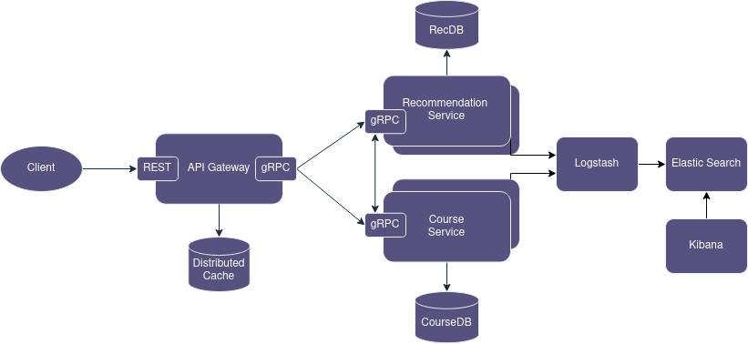

# FAF.PAD16.2 -- Lab 1: Web Proxy
> **Performed by:** Vlada Magal, group FAF-203 \
> **Verified by:** asist. univ. Maxim Voloșenco

## How to Run this BS

### Docker
In the root folder, run:
```bash
docker compose up --build
```

Note: might need to run twice.

### Kubernetes
In the root folder, run:
```
kubectl apply -f data.yaml
kubectl apply -f services.yaml
```

Note: make sure you've got a Kubernetes cluster running.

#### Kubernetes Note

Linkerd was used after noticing that setting up a ClusterIP wasn't enough to load balance gRPC requests equally to all replicas (check out this [arcticle](https://kubernetes.io/blog/2018/11/07/grpc-load-balancing-on-kubernetes-without-tears/)).

To inject the service mesh into the cluster, do the following:

1. Install [Linkerd](https://linkerd.io/2.14/getting-started/).
2. In the root folder, run:
```bash
kubectl apply -f data.yaml
linkerd inject services.yaml | kubectl apply -f -
```

The data sources do not need to have proxies since there's only 1 instance of each.

### Make Requests

Import the Postman collection (json file in root folder) given and have fun. I guess.

## Checkpoint 1

### Topic

The topic for the first PAD lab is a free, open source **MOOC (Massive Online Open Course) Education Platform** (alike Coursera).

### Application Suitability

A microservices architecture would fit the topic because of:

* Modularity -- it is a complex application, composing of multiple componenents that have clear boundaries (for ex. User Service, Course Service, Video Service, Auth Service, Email Service); a distributed architecture allows each component to be developed (relatively) in parallel.
* Scalability -- the topic implies a large number of requests  since it is an application for *massive* online courses, so a distributed architecture allows scaling up the components as needed to load the bear more efficiently.
* Language Agnosticism -- each microservice can be written in a language more fitting for the service's purpose. In this case, an Email Service or Gateway could be written in Elixir, for example, and some other microservices in Go.
* Fault isolation/tolerance -- a failure in one microservice must not impact the whole application.

Some projects that focus on MOOC education and employ microservices are: edX, Coursera.

### Service Boundaries

Services:
* Recommendation Service -- responsible for generating recommendations for courses.
* Course Service -- responsible for managing courses.
* Gateway -- defines the API for the whole platform. Responsible for "forwarding" the request to the specific microservice and collecting the responses. Must also validate the incoming requests and ensure that protected routes are only accessible to authenticated requests.

A simple architecture diagram:


### Tech Stack and Communication Patterns

* Recommendation Service
  * Language: Python
  * Frameworks: gRPC, sqlAlchemy, pandas
  * Communication: synchronous communication via RPC
  * Database: Postgres
* Course Service
  * Language: Go
  * Frameworks: gRPC, Gorm
  * Communication: synchronous communication via RPC
  * Database: Postgres
* Gateway
  * Language: Elixir
  * Frameworks: gRPC, Phoenix
  * Communication: synchronous communication via RPC (with the microservices) and via a REST API with the client.

### Data Management
#### Data
Each service will have its own database/cache, since the data is modular enough that sharing one data source is not necessarry.

The Rec Service will store courses data for the dataframe in a Postgres DB. 

The Course Service will store course-adjacent data (courses, course categories, course chapters, users_courses cross ref table) in a Postgres DB. 


#### Endpoints

HTTP Gateway endpoints: 

* Course `/api/v1/courses`
  * GET `?page={page}&limit={limit}` -- gets all courses, paginated
    * Response body:
    ```json
    [{
      "id": "60ba873d-721b-436e-a687-06e8c6298623",
      "author": {
        "id": "60ba873d-721b-436e-a687-06e8c6298623",
        "username": "madalv",
        "first_name":  "Vlada",
        "last_name": "Magal",
      },
      "title": "Very Nice Course",
      "description": "This is a very nice course."
      "created_at": "2023-09-12T17:34:36.261285961Z",
      "updated_at": "2023-09-12T17:34:36.261285961Z"
    }, ...]
    ```
  * GET `/:id` -- gets course by ID
    * Response body:
    ```json
    {
      "id": "60ba873d-721b-436e-a687-06e8c6298623",
      "author": {
        "id": "60ba873d-721b-436e-a687-06e8c6298623",
        "username": "madalv",
        "first_name":  "Vlada",
        "last_name": "Magal",
      },
      "title": "Very Nice Course",
      "description": "This is a very nice course."
      "categories": [{
        "id": "70ba873d-721b-436e-a687-06e8c6298623",
        "title": "Software Engineering"
      }, ...],
      "created_at": "2023-09-12T17:34:36.261285961Z",
      "updated_at": "2023-09-12T17:34:36.261285961Z",
      "chapters": [{
        "course_id": "80ba873d-721b-436e-a687-06e8c6298623",
        "id": "80ba873d-721b-436e-a687-06e8c6298623",
        "title": "Chapter 1 Title",
        "body": "body"
      }, ...],
    }
    ```
  * POST `/` -- creates course
    * Request body:
    ```json
    {
      "title": "Very Nice Course",
      "description": "This is a very nice course.",
      "author_id": "70ba873d-721b-436e-a687-06e8c6298623",
      "categories": ["70ba873d-721b-436e-a687-06e8c6298623"]
    }, ...],
    }
    ```
  * GET `/:id/recommendations?recs_nr={nr}`
    * Response body:
    ```json
    {
    "recs": [
        {
            "id": "73423313-6745-4f65-9f49-caca69450302",
            "title": "Introduction To Java Programming"
        },
        {
            "id": "2d2a1c58-00db-438f-9a40-7326dad3d77b",
            "title": "Introduction To Perl Programming"
        }
      ]
    }
    ```
  * POST `:id/enroll` -- enrolls authenticated user into specified course 

* Chapter `api/v1/chapters`
  * GET `/:id` -- get course chapter
    * Response body:
    ```json
    {
      "id": "60ba873d-721b-436e-a687-06e8c6298623",
      "course_id": "70ba873d-721b-436e-a687-06e8c6298623",
      "title": "Chapter 1 Title",
      "created_at": "2023-09-12T17:34:36.261285961Z",
      "updated_at": "2023-09-12T17:34:36.261285961Z",
      "body": "In this chapter we will learn...",
    }
    ```
  * POST `/` -- creates chapter
    * Request body:
    ```json
    {
      "title": "Chapter 1 Title",
      "body": "In this chapter we will learn...",
      "course_id": "70ba873d-721b-436e-a687-06e8c6298623",
    }
    ```
  * DELETE `/:id` -- deletes course chapter

* User `/api/v1/users`
  * GET `/:id/recommendations?recs_nr={nr}` -- gets an amount of recommendations for a user based on the courses the user is enrolled in
    * Response body:
    ```json
    {
    "recs": [
        {
            "id": "73423313-6745-4f65-9f49-caca69450302",
            "title": "Introduction To Java Programming"
        },
        {
            "id": "2d2a1c58-00db-438f-9a40-7326dad3d77b",
            "title": "Introduction To Perl Programming"
        }
      ]
    }
    ```

### Deployment and Scaling

The services and databases will containerized using Docker. For container orchestration, scaling pods, and load balancing I'll set up a Kubernetes cluster.